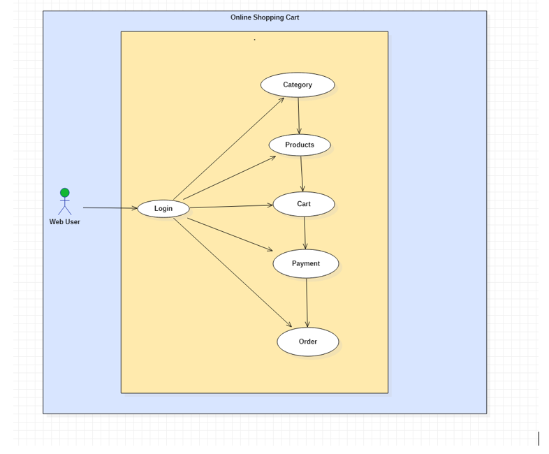
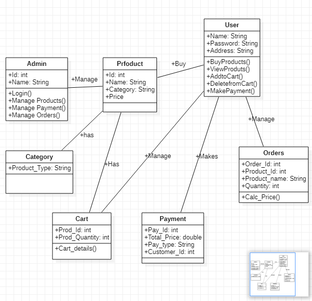

**Project Title:**

`                     `Online Shopping Cart

**Project Purpose & Goal:**

`   `The main objective of Online Shopping Cart is to manage the details of shopping, payment ,bills , customer and**  products **.**            

**Project Scope:**
**
`       `This project covers the online selling of cosmetics, Groceries, Clothing, Electronics  etc. The project shows the product category and then product details. From the product details, the product can be added to cart and can be bought and reaches to successful order.

**High Level Design:**
**
`          `It explains the architecture that would be used for developing a software product.

It provides a view of the system at an abstract level. It shows how the major pieces of the finished application will fit together and interact with each other.

**Low Level Design:**
**
`                                                          `It is a component-level design process that follows a step-            by-step process. It gives the internal logical design of the actual program code.

- Low-level design is created based on the high-level design. LLD describes the class diagrams with the methods and relations between classes and program. 
- ` `It describes the modules so that the programmer can directly code the program from the document.

**Classes:**

- **Product**: It list the available products
- **WebUser**: Performs operations like add product to the cart, Placing Order, Bill payment
- **Order**: specifies the quantity of the product
- **Payment**: it can be made in the form of cash and card
- **Car**t: Contains the products which the user added to it
- **Category**: lists type of products
- Classes and their attributes:

**Attributes:**

- **Product**: Product_id, Product2_type
- **User**: User\_id, User\_Name, Password, Mobile, Email, Address
- **Order**: Order\_id, Order\_Type, Customer\_id, Customer\_Name
- **Cart:** id, Price, Num\_of\_products
- **Payment**: id,Paid, Total
- **Category**: Type of product

**                  

